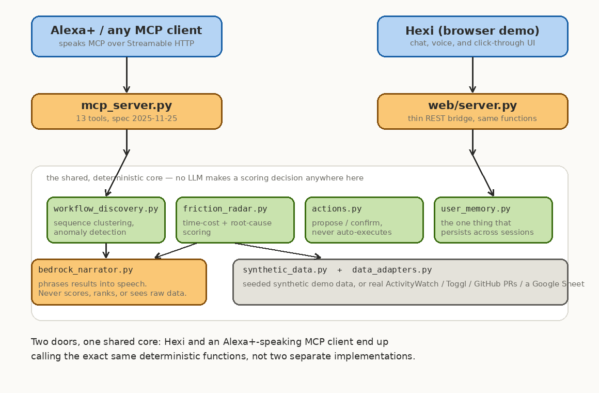

# Isse Automate Kardo

Alexa+ watches how you work, finds where the time actually goes, and tells
you exactly what's worth automating — you say yes, and only then does it act.

Built for Amazon's **Build, Ship, Shape** hackathon, **Alexa+ track**, with
an entry in the **Open Source** mini challenge.

## Meet Hexi

<p align="center">
  
</p>

Hexi is the small hexagonal character who lives in this project's browser
demo. She isn't decoration — every expression she makes is a direct
reaction to a real call into the analysis pipeline underneath her, not a
scripted animation.

She starts out **asleep** if the server isn't running yet, and settles into
a calm, breathing **idle** once it is:

<p align="center">
  
  &nbsp;&nbsp;&nbsp;
  
</p>

As you click through a simulated workspace, or just ask her something, she
goes **watching**, then **curious** the moment a real pattern turns up in
the data, then **suggesting** while she works out whether it's worth
automating — and finally **confirmed** once you've said yes and the
automation actually runs. Say "stop suggesting this" and she remembers it,
even after the server restarts; ask "what's costing me the most time" or
"brief me" and she'll tell you out loud.

Try her yourself — see **Running it** below.

## The journey

```
"Alexa, what patterns are in my work?"
   -> discover_workflows()             clusters raw event sequences into
                                         workflows -- no pre-existing label,
                                         genuine sequence-similarity clustering

"Where am I wasting time?"
   -> get_top_friction_points()        ranks workflows by total time cost
                                         + automation tier

"Why does bug triage take so long?"
   -> debug_workflow()                 step-level bottleneck breakdown

"Was there anything unusual?"
   -> detect_anomalous_runs()          flags runs that blew past the usual
                                         range, and names the likely cause

"Can you automate the reporting steps?"
   -> propose_automation()             concrete, step-level proposal;
                                         never executes on its own
"Yes."
   -> confirm_automation()             executes only after you say so

"Just give me the rundown."
   -> narrate_briefing()               turns the already-computed findings
                                         into one spoken answer
```

## How it's built

<p align="center">
  
</p>

**Protocol.** The MCP server (`src/mcp_server.py`) speaks Streamable HTTP
at `/mcp` and negotiates MCP spec **2025-11-25**, the hackathon's minimum.
That is checked by a real MCP client against the running process
(`tests/test_mcp_protocol.py`), and the bridge Hexi uses refuses any server
that negotiates an older version (`web/mcp_bridge.py`). It has not been
tested inside an Alexa+ surface, because none is available to developers.

Clustering, scoring, and anomaly detection are all deterministic — no LLM
involved anywhere in this pipeline, including `narrate_briefing`: it turns
numbers this project already computed into a sentence via a fixed
template, never a model call. It never ranks, scores, or touches the
underlying data itself, and it has no external dependency or credential to
configure — it returns the same complete, correct answer every time.

The pipeline isn't tied to synthetic data, either. `data_adapters.py` reads
real [ActivityWatch](https://github.com/ActivityWatch/activitywatch) and
Toggl Track exports, a public GitHub repo's own pull-request history (read
only — it never clones or runs a repository's code), or a public Google
Sheet, and runs the exact same label-free discovery against any of them.

And one thing genuinely persists across sessions: `user_memory.py` is the
one piece of state in this project backed by a file on disk rather than
kept only for the length of a conversation. Tell it to stop suggesting a
workflow, and it stays stopped — restart the server entirely, and it's
still true.

The full research citations behind the clustering and ranking methods,
the complete MCP tool list, and an honest list of what hasn't been tested
yet live in [`docs/RESEARCH_AND_NOTES.md`](docs/RESEARCH_AND_NOTES.md) —
kept out of here so this stays readable, not because there's nothing to
say about them.

## Running it

Two services, one shared core. Start both for the full demo:

| Service | Command | Serves |
|---|---|---|
| MCP server | `python src/mcp_server.py` | MCP over Streamable HTTP, `http://localhost:8000/mcp` |
| Hexi web demo | `python web/server.py` | The page and `/api/agent`, `http://localhost:5000` |

### Locally

```bash
pip install -r requirements.txt
python src/synthetic_data.py     # generates data/*.json (idempotent)
python src/mcp_server.py         # terminal 1: MCP server, Streamable HTTP at :8000/mcp
python web/server.py             # terminal 2: Hexi on :5000
```

The MCP server alone is enough for any MCP client (Alexa+, MCP Inspector).
Hexi's typed chat and tabs also work without it; only the voice path and
the extension need the MCP server running.

### With Docker

```bash
cp .env.example .env             # optional -- see .env.example; fine to skip
docker compose up --build        # starts both services, ports bound to localhost
```

The image and compose file have not been built or run in the environment
this was developed in; treat the first `docker compose up` as the test.

### Hexi (interactive browser demo)

Open `http://localhost:5000`. Click through the tabs, watch Hexi notice a
repeatable pattern and propose automating it, confirm or dismiss it, then
restart the server and check that a dismissal is still remembered. Type
into the chat box, or click **Speak**, and ask her to brief you out loud.

**Voice runs through MCP.** A spoken request is transcribed by the browser,
classified by `web/static/intents.js`, and sent to `POST /api/agent`, which
calls the matching tool on the MCP server with the official MCP client
(`web/mcp_bridge.py`). The status bar shows which tools ran and the
negotiated protocol. Automation is two utterances: "automate it" only calls
`propose_automation`; the next "yes" calls `confirm_automation`, so one
misheard word can't execute anything. If the MCP server isn't running,
`/api/agent` returns 503 and the page says so and uses its direct path.

```bash
curl -s localhost:5000/api/agent -H 'content-type: application/json' \
  -d '{"intent": "friction"}'
```

Request body: `{intent, workflow?, proposal_id?}`. Response: `reply`,
`mood`, `tools`, `protocol`, `pending_proposal_id`. Malformed or unrecognised
input gets a normal reply listing what can be asked, not an error; the
only error statuses are 413 (oversized body), 503 (MCP server down) and
500 (unexpected failure), each with a `reply` field.

**Input handling.** `intents.js` strips markup and control characters,
caps input at 300 characters, and corrects small typos ("automte it",
"anomolies") with one-edit matching on 5+ letter words that share a first
letter, so lookalikes such as "grief" don't become "brief". It is still
keyword matching, not language understanding: phrasing outside its
vocabulary gets example prompts back.

Voice input uses the browser's speech recognition (Chrome, Edge, Safari).
In Chrome and Edge the audio is sent to the browser vendor's cloud service
for transcription; Hexi's spoken replies are generated on your device.

**Bring your own data**, from the "My data" tab: an ActivityWatch or Toggl
export, a pasted list of steps, a public GitHub repo, or a public Google
Sheet/Drive link. Every path only ever reads and parses — nothing pasted
in is ever executed.

### Chrome extension (side panel)

`extension/` is a Manifest V3 side panel that sends the same requests to
`/api/agent` from any tab, showing each stage (heard, routed, request, MCP
tool, reply) as it runs.

1. Start both services.
2. Open `chrome://extensions`, enable Developer mode, choose **Load
   unpacked**, and select the `extension/` folder.
3. Click the Hexi toolbar icon. Type, use a chip, or press **Speak**.

It talks only to `localhost` / `127.0.0.1` (default `http://localhost:5000`;
use **Server** in the panel for another port). It carries its own copy of
`intents.js`; run `extension/sync.sh` after changing the original, and a
test fails if they differ. Tested: manifest, file references, and the
request logic in node, including against both live servers. Not tested:
loading it into Chrome, and microphone capture in the side panel, where
Chrome may require the one-time **Grant microphone** step.

**Said plainly, because it matters:** a website cannot see your other
browser tabs or other sites — that's a hard security boundary, not a
limitation of this build. Hexi "watches" a sandboxed workspace built into
this one page, not your real tabs, and the extension does not read page
content either. Real cross-tab visibility would need broad permissions and
a real consent design, which is a different, bigger product than this
hackathon build attempts.

### Tests

```bash
pytest tests/                     # unit + integration tests
python tests/evaluation.py        # ranking-engine quality metrics
python tests/segmentation_eval.py # segmentation quality vs. ground truth
```

CI (`.github/workflows/ci.yml`) runs all three on every push to `main`.

---

MIT licensed — see [`LICENSE`](LICENSE).
